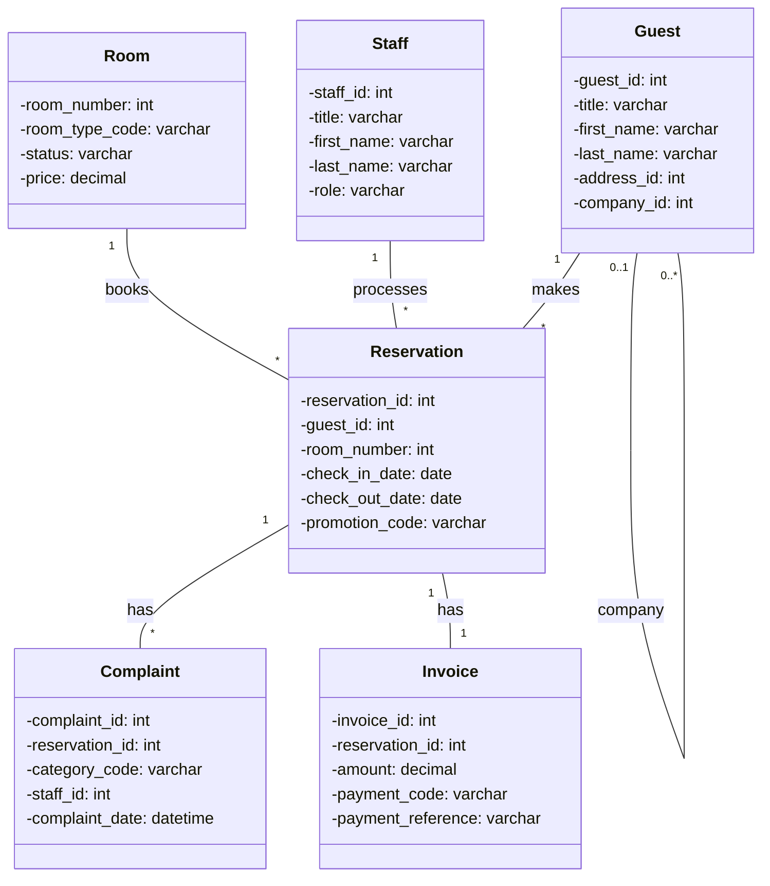
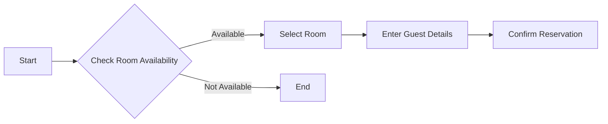

# Design Specification

## System Architecture
The hotel management system will be a three-tier application consisting of:

1.  **Presentation Tier (Front-end):**
    *   Provides the user interface for interacting with the system.
    *   Built using HTML, CSS, and JavaScript.
    *   Will allow receptionists and managers to perform their tasks.
2.  **Application Tier (Back-end):**
    *   Implements the business logic of the system.
    *   Built using Node.js and Express.js.
    *   Handles requests from the front-end and interacts with the database.
3.  **Data Tier (Database):**
    *   Stores the system's data.
    *   Uses a relational database (MySQL) based on the provided database design.

## Class Diagrams

## Flowcharts

## Pseudocode
(To be added in subsequent steps)

## Justification
This three-tier architecture provides a clear separation of concerns, making the system more maintainable and scalable. The front-end will handle user interactions, the back-end will handle business logic, and the database will handle data storage. This approach aligns with best practices for software development.
